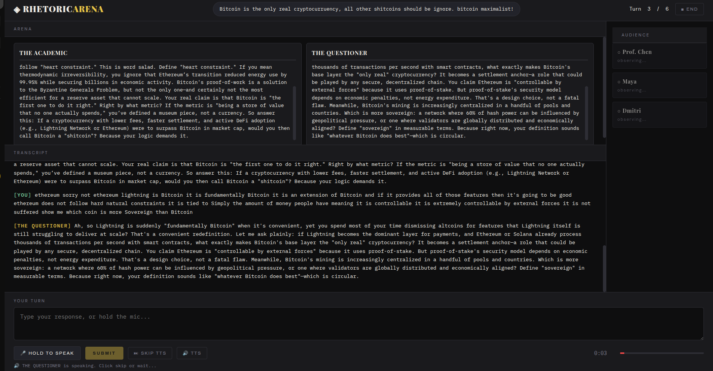

# RhetoricArena

Sharpen your arguments against AI opponents that fight back. RhetoricArena puts you on the clock, scores your reasoning in real time, and tells you exactly where you lost the room.

Pick any motion, choose your opponents, and step into the arena.


Two AI debaters argue their side out loud via TTS. When it's your turn, hold the mic and make your case — you have 60 seconds. No notes, no retakes.



The moment you finish speaking, an evaluator breaks down your structure, logic, and rhetoric — and tells you the one thing you need to fix next turn.


At the end, the audience delivers their verdict: were they convinced? Each member explains why — or why not.


## Run locally

```bash
python3 -m venv venv
source venv/bin/activate
pip install -r backend/requirements.txt

# Optional: put a key in .env so the app uses yours by default.
# Otherwise the app will prompt for one in the browser.
echo "DEEPSEEK_API_KEY=sk-..." > .env

uvicorn backend.main:app --reload --port 8000
# open http://localhost:8000 in Chrome
```

## Deploy to Coolify

Coolify reads the `Dockerfile` in the repo root and handles the rest. One-time setup:

1. **In Coolify** → New Resource → Application → Public or Private Repository → paste this repo URL.
2. **Build Pack:** Dockerfile (auto-detected). **Port:** `8000`. **Domain:** whatever you want.
3. **Environment variables (optional):**
   - `DEEPSEEK_API_KEY` — if set, every visitor uses your key (the BYOK prompt is hidden). Leave it unset if you want each user to bring their own key.
4. **Persistent storage (optional):** mount `/app/storage` if you want session JSON files to survive redeploys. Skip it if you don't care about saved transcripts.
5. **Deploy.**

**Auto-deploy on push:** in the Coolify app's *Settings* tab, copy the webhook URL and add it to your GitHub repo (Settings → Webhooks → Add webhook → paste URL → content type `application/json` → push events). Every `git push` to the tracked branch triggers a rebuild.

That's it. No image registry, no compose file, no manual `docker build`.

## Bring Your Own Key (BYOK) flow

If the server has no `DEEPSEEK_API_KEY` env var, the config screen shows a key field and a disclaimer. The user pastes their `sk-...` key:

- Sent over HTTPS to the backend on session creation.
- Stored in process memory for the lifetime of that session only.
- Never written to disk. Never logged. Cleared on restart and on session delete.
- Cached in the user's browser `localStorage` so they don't repaste each visit.

Each debate run costs roughly 1–3 cents at DeepSeek's prices. The disclaimer in the UI tells the user this directly.

## Architecture

- `backend/` — FastAPI app, agents, debate engine
- `frontend/` — vanilla HTML/CSS/JS, no build step
- `storage/sessions/` — auto-created, one JSON per session

## Agents

| Agent | When | Purpose |
|---|---|---|
| Moderator | Open + close | Frames the debate |
| Debater(s) | Each AI turn | Argue the opposing side |
| Evaluator | After each user turn | Toastmasters-style feedback |
| Audience | At end | Independent reactions and votes |
| Analyst | At end | Full rhetorical report |

All run on `deepseek-chat`. Cost per session is roughly a few cents.

## Voice input

Uses the browser-native Web Speech API. Chrome only. Hold the mic button, speak, release to populate the input box. Submit normally.
